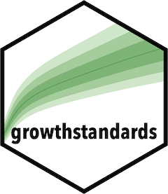

```{r global_options, include=FALSE}
# R output pre blocks are styled by default to indicate output
knitr::opts_chunk$set(comment = NA)
```

[](https://travis-ci.org/ki-tools/growthstandards) [](https://codecov.io/gh/ki-tools/growthstandards?branch=master)

# growthstandards 

The "growthstandards" R package provides methods for converting anthropometric measurements to or from z-scores and centiles using the WHO and INTERGROWTH growth standards. The WHO standard are used for infants, children, and young adults. INTERGROWTH standards are provided for fetal and newborn (including very preterm) calculations.

This document provides a walk-through of much of the package's functionality, provided through examples and discussion.  The package reference page has an exhaustive listing of all of the exported functions in the package along with detailed documentation about their parameters and usage.

## Installation ##

The growthstandards package is not yet on CRAN. You can install it from Github with the following:

```{r install, eval=FALSE}
# install.packages("remotes") # if "remotes" is not already installed
remotes::install_github("ki-tools/growthstandards")
```

Once the package is is installed, you simply need to load it:

```{r load, eval=TRUE, echo=TRUE}
library(growthstandards)
```

## General Usage ##

Click [here](articles/usage.html) to learn how to use the package.
